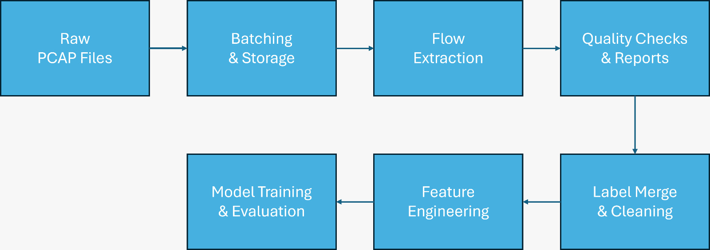
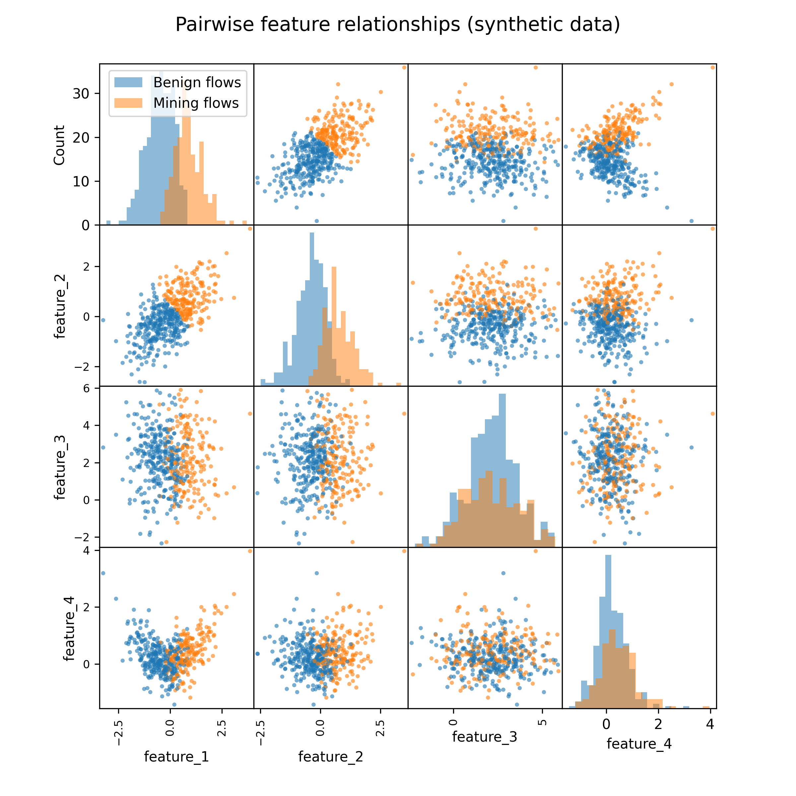
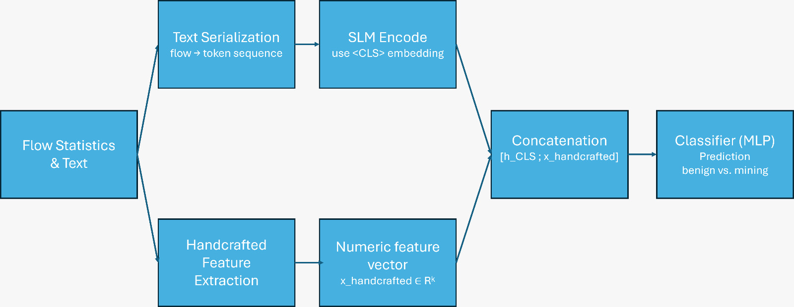
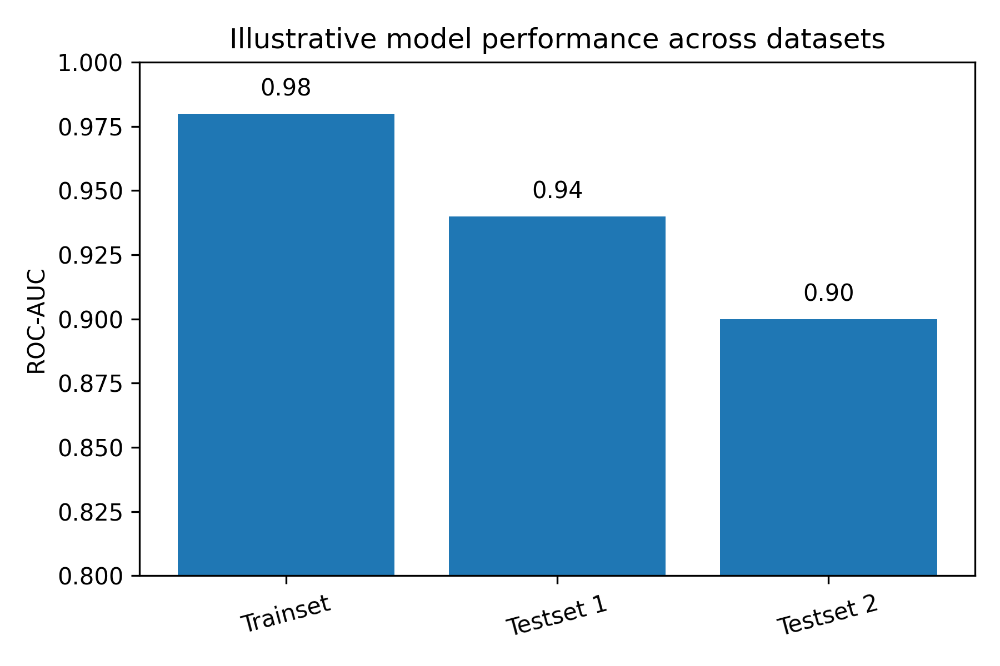

# Crypto-mining traffic detection (case study)

This repository documents a client project where I designed and implemented an end-to-end machine learning pipeline to detect crypto-mining activity in network traffic.

The actual production code and data are proprietary and **not** included here. Instead, this case study focuses on the problem, the type of data involved, the pipeline architecture, the handcrafted feature design and the evaluation strategy. All figures are based on synthetic or illustrative data.

---

## Problem

Unwanted crypto-mining on company machines or cloud resources can silently consume hardware, increase energy costs and reduce system stability.

The client needed a way to automatically analyse large volumes of network traffic and flag connections that are likely related to crypto-mining, while:

- keeping false alarms low enough for security teams to handle, and
- keeping the pipeline extensible for new datasets and further model improvements.

---

## Data (high-level) and constraints

This project combined several types of flow-level network data:

- **Public research-style datasets**
  Commonly used in academic work on malicious or unusual traffic.
- **Lab traffic** 
  Controlled scenarios where crypto-mining activity was generated under known conditions.
- **Production-like traffic** 
  Network captures with a mixture of benign and potentially suspicious connections.

To protect client interests and any future publications, dataset names, exact scenarios and experimental designs are intentionally described in a generic way.

### Key challenges

- **High volume** 
  Millions of flows across multiple captures and scenarios.
- **Heterogeneous formats** 
  Different export formats and schemas between datasets.
- **Imbalanced labels** 
  Benign traffic heavily outnumbering mining-related flows.
- **Resource constraints** 
  Memory and storage limits on the processing server.
- **Operational robustness** 
  The pipeline needed to handle corrupted files, partial runs and resumable processing.

---

## Pipeline architecture

The solution is an end-to-end pipeline that transforms raw packet captures into model-ready features. On a high level, the steps are:

1. **Raw PCAP Files** 
   - Ingest packet captures from different sources and datasets.

2. **Batching & Storage** 
   - Split large captures into manageable chunks for processing. 
   - Normalise folder and file naming conventions across datasets.

3. **Flow Extraction** 
   - Parse packets and aggregate them into bidirectional flows. 
   - Store flows in columnar formats (e.g. Parquet) for efficient downstream processing.

4. **Quality Checks & Reports** 
   - Compute basic statistics per batch (flow counts, duration, byte distributions). 
   - Generate automatic QC reports to catch anomalies early.

5. **Label Merge & Cleaning** 
   - Join flow records with external label sources (e.g. scenario-level labels). 
   - Handle duplicate flows, missing labels and inconsistent timestamps.

6. **Feature Engineering** 
   - Compute a shared, interpretable feature set that works across all datasets. 
   - Standardise feature names, types and units.

7. **Model Training & Evaluation** 
   - Train baseline models and evaluate their ability to generalise across datasets. 
   - Analyse precision/recall trade-offs and feature importance.

The following figure sketches this pipeline on a conceptual level:

*High-level pipeline: from raw PCAP files to model-ready features and evaluation. The actual implementation uses multiple scripts and QC steps to make this robust for large datasets.*

---

## Handcrafted features

A key design goal was to define a **compact, interpretable feature set** that can be computed consistently across all datasets and understood by security experts.

Examples of feature groups:

- **Traffic volume & duration** 
  - Total bytes and packets per flow 
  - Flow duration
- **Directionality** 
  - Forward / backward byte and packet ratios 
  - Indicators for asymmetric communication patterns
- **Port & protocol patterns** 
  - Common port usage patterns 
  - Protocol information where available
- **Temporal behaviour** 
  - Inter-arrival times between flows 
  - Simple burstiness indicators

These features make it possible to:

- understand which traffic characteristics drive model decisions, 
- compare behaviour across lab, research-style and production-like data, and 
- build lighter-weight models that do not depend on heavy textual encodings.

The synthetic scatter matrix below illustrates how such features can be inspected pairwise:

*Pairwise relationships between synthetic features. Colour indicates a synthetic binary label (e.g. benign vs. mining). Real project data is not shown.*

---

## Modeling & evaluation

For this project, the modelling approach was structured in two layers:

1. **Baseline models on handcrafted features** 
   - Tree-based models and gradient boosting on the numeric feature set. 
   - Focus on:
     - robustness, 
     - interpretability, 
     - and cross-dataset generalisation.

2. **Advanced approach (work in progress)** 
   - Serialising flow information into a textual representation. 
   - Feeding this text into a small language model (SLM). 
   - Combining the SLM’s `<CLS>` embedding with the handcrafted feature vector for a joint representation.

### High-level joint architecture

The advanced setup combines a textual representation of each flow with handcrafted numeric features:

Conceptually:

- Raw flow statistics are converted into a compact numeric feature vector.  
- In parallel, a textual representation of the flow is encoded by a small language model (SLM); the final `<CLS>` embedding serves as the flow’s text representation.  
- Both vectors are concatenated into a joint representation, which is then passed to a downstream classifier (e.g. a small MLP).

### Evaluation strategy

The evaluation was designed to reflect realistic deployment questions:

- Train on one dataset (e.g. mainly lab or research-style traffic), 
  then test on another (e.g. more production-like traffic) to measure **generalisation**.
- Track metrics such as:
  - ROC-AUC 
  - precision/recall 
  - confusion matrices at relevant thresholds
- Focus on:
  - catching as many mining flows as possible (high recall), 
  - while keeping the false positive rate at a level that is still workable for security teams.

The following bar chart is an **illustrative** example of how cross-dataset performance might be summarised:

*Illustrative ROC-AUC values for one train set and two test sets. Values are synthetic and for demonstration only.*

---

## My role

In this project, I was responsible for:

- **Pipeline design** 
  - Designing the overall architecture from raw PCAP files to model-ready features.
- **Implementation** 
  - Implementing flow extraction and preprocessing steps in Python. 
  - Handling batching, storage and resource constraints.
- **Feature definition** 
  - Defining a shared, interpretable feature schema across heterogeneous datasets.
- **Quality assurance** 
  - Implementing quality checks and automatic QC reports for each batch.
- **Model training & analysis** 
  - Training baseline models and analysing their performance across datasets. 
  - Exploring the combination of handcrafted features with SLM embeddings.
- **Communication** 
  - Explaining results, limitations and trade-offs in a way that was accessible to non-ML experts.

---

## Technologies

- **Language:** 
  - Python
- **Data processing:** 
  - pandas, columnar storage (e.g. Parquet), command-line tools for packet capture parsing
- **Machine learning:** 
  - scikit-learn (for baseline models) 
  - (optionally PyTorch / TensorFlow for SLM experiments)
- **Environment & tooling:** 
  - Linux, Git, notebooks for exploration 
  - Simple reporting scripts for QC and metrics

---

## About confidentiality

This repository is intentionally limited to a high-level case study:

- No client code, configuration files or proprietary data are included. 
- All code written for the production pipeline is owned by the client and is **not** part of this repository. 
- Dataset names, exact scenarios and experimental designs are described in a generic way on purpose, out of respect for the client. 
- All plots in `figures/` are based on **synthetic or illustrative data** and do not expose real client traffic or results.

The goal of this case study is to illustrate **how I approach building a robust ML pipeline for crypto-mining detection**, not to reveal the specifics of any ongoing client work.

---

## Related repositories

This case study is part of my freelance portfolio. 
For runnable code examples of my work, see my other repositories (examples):

- [Monte Carlo risk simulation](https://github.com/vangenent/PFE_Ornstein-Uhlenbeck) 
- [PEM electrolyzer economic modeling](https://github.com/vangenent/hydrogen_pem_economics) 
- [Customer segmentation with K-Means](https://github.com/vangenent/customer_segmentation)

These projects show how I implement data pipelines, simulation and modelling in practice.

